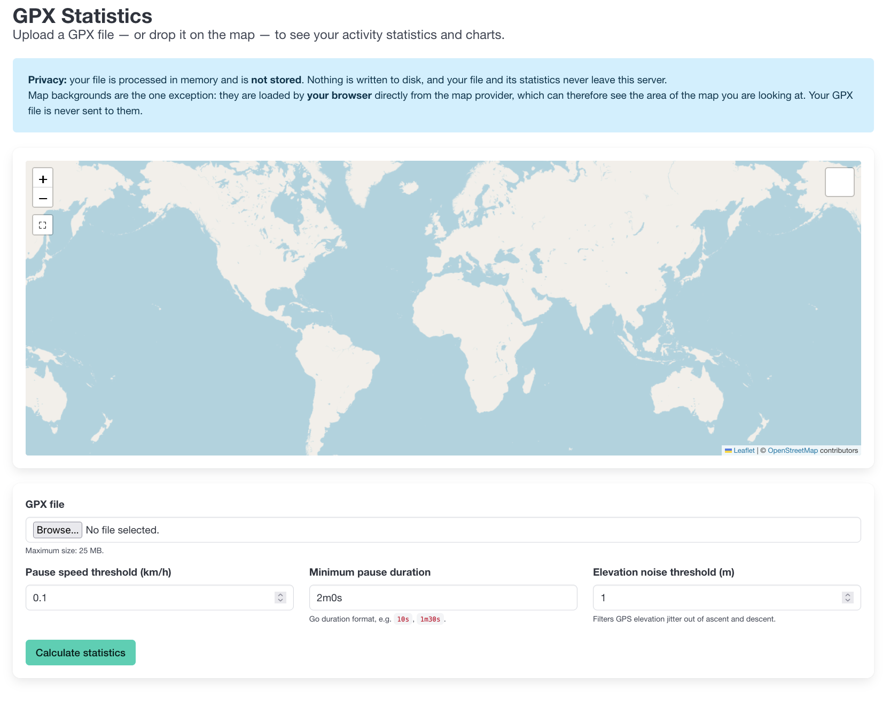
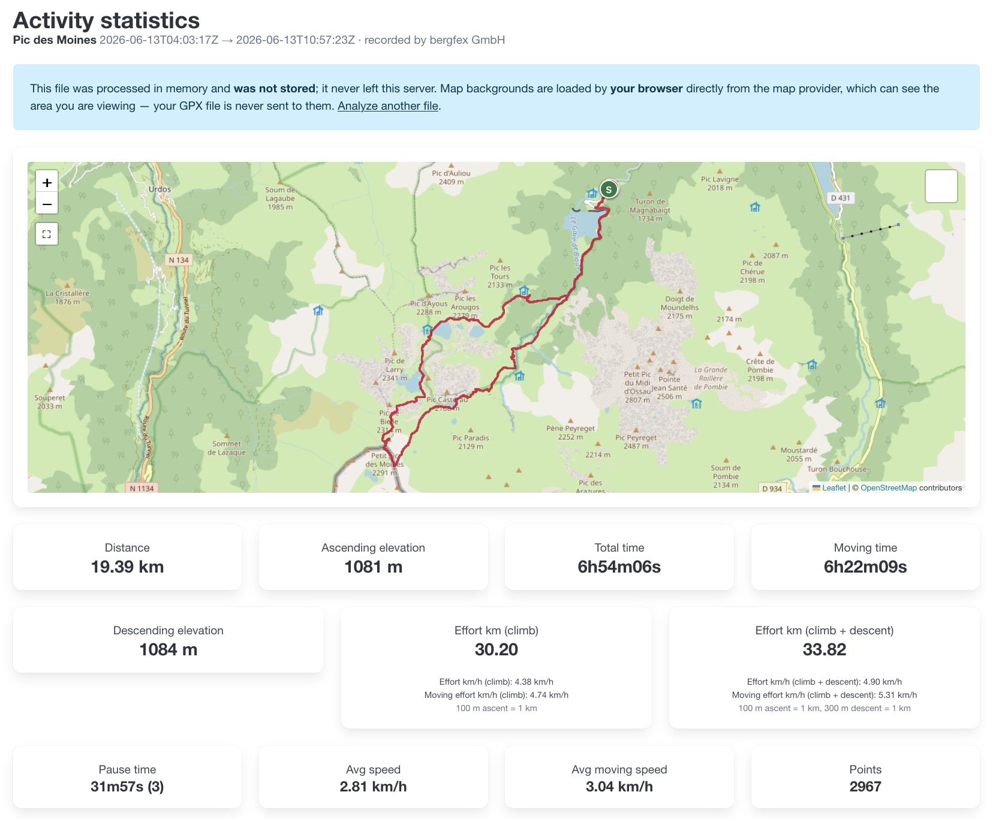
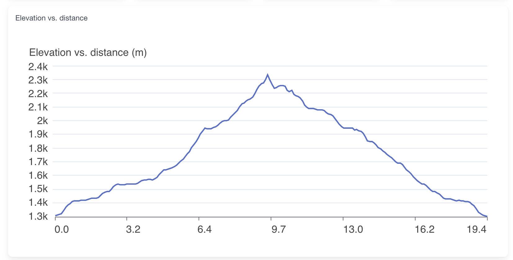
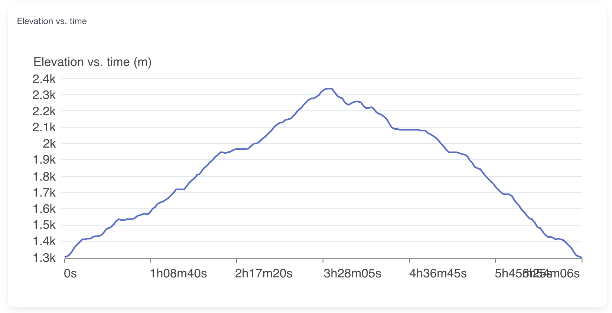
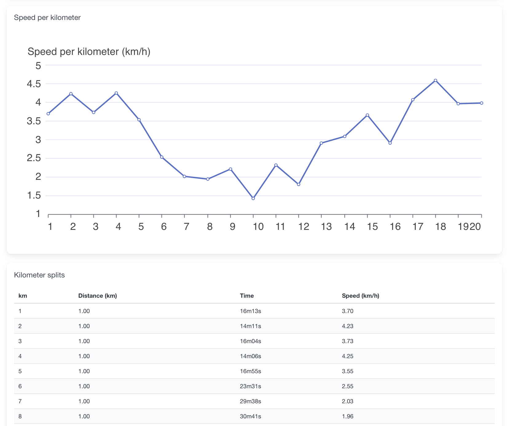

# gpx-stats

A single, self-contained Go binary that computes statistics about a GPX file —
from the command line or through a small embedded web UI. **No database, no
server-side network calls, nothing stored.**

> The web UI now shows your track on a map. Map *backgrounds* are loaded by your
> browser directly from the tile provider, which can see the area you are
> viewing. Your GPX file and its statistics never leave the server. See
> [Privacy](#privacy).

## Demo


## Features

- **CLI**: pass a GPX path, get raw statistics as text (or `--json`), plus
  optional ASCII charts in the terminal.
- **Web UI**: `serve` starts a local page where you upload a GPX file — or drop
  it straight onto the map — and see the same statistics rendered with inline
  SVG charts. The file is processed in memory and is never saved.
- **Interactive map**: the recorded track is drawn over a choice of four free
  base layers (OpenStreetMap, OpenTopoMap, CyclOSM, Humanitarian), framed on the
  activity with start/end markers, and expandable to full screen. Every recorded
  point is drawn — the line is never simplified — and each recorded segment is
  drawn as its own line, so an interrupted recording never shows a line across
  ground you did not travel.
- **MVP statistics**: total distance (km), ascending and descending elevation
  (m), total / moving / pause time, number of pauses, average and moving speed
  (km/h), and per-kilometer splits (time + speed).
- **Activity identity**: the activity's name, type, recording device, and start
  and end times, read from the file and shown on every surface. See
  [Activity identity](#activity-identity).
- **Segment-aware**: a GPX file whose recording was interrupted is not treated as
  one continuous line. See [Segments](#segments).
- **Effort kilometers**: the flat distance that would cost the same effort as
  the hilly route, reported under both common conventions. See
  [Effort kilometers](#effort-kilometers).
- **Safe by construction**: GPX is parsed with the standard library
  `encoding/xml`, which ignores DTDs and external entities, so XXE and
  entity-expansion ("billion laughs") attacks are neutralised. Input is bounded
  by a maximum size and track-point count.

## Build

```sh
go build -o gpx-stats ./cmd/gpx-stats
# or: task build
```

The binary embeds all web assets (Bulma CSS, HTML templates); copy it anywhere
and run it offline.

## CLI usage

```sh
gpx-stats path/to/activity.gpx            # human-readable statistics
gpx-stats --json path/to/activity.gpx     # machine-readable JSON
gpx-stats --charts path/to/activity.gpx   # add ASCII elevation & speed charts
gpx-stats --version                       # build identity: version, commit, date, Go

# Tune pause detection (defaults: 0.1 km/h sustained for 2m0s)
gpx-stats --pause-speed 1.5 --pause-duration 15s path/to/activity.gpx

# Tune how aggressively GPS elevation jitter is filtered (default: 1 m)
gpx-stats --elevation-noise 3 path/to/activity.gpx
```

Errors are written to stderr with a non-zero exit code (1 runtime, 2 usage).

### Version

`--version` reports which build you are running, which is what a bug report needs from a
self-contained binary with no package manager behind it:

```
$ gpx-stats --version
  gpx-stats  0.4.0
  commit     96c9f3edee5d1bb1c655910e2a42b8b0d871144c
  built      2026-07-07T18:58:31Z
  go         go1.26.1 darwin/arm64
```

Released binaries carry the values stamped at link time. A binary you built yourself falls back,
per field, to the build information the Go toolchain embeds on its own — so `go build` of your own
tree reports a pseudo-version with the real commit and commit time, `go install ...@v0.4.0` reports
the tag but no commit, and anything neither source supplies reads `unknown`. The flag needs no file
argument and must come before the path.

### Terminal styling

The text output is grouped into sections, and its labels and values are aligned
in one column sized to whatever the file actually reports — a track with no
elevation gets a narrower report, not a padded one.

Section headings are shown in bold and units in dim **only when stdout is a
terminal**. Redirect or pipe the output and it is plain text, so nothing has to
strip escape sequences. Styling is bold and dim only: a hue that reads well on a
dark background is often invisible on a light one. To turn it off on a terminal
too, any of these works:

```sh
gpx-stats --no-color path/to/activity.gpx
NO_COLOR=1 gpx-stats path/to/activity.gpx
TERM=dumb gpx-stats path/to/activity.gpx
```

## Effort kilometers

A hilly route costs more than its flat distance suggests. *Effort kilometers*
("km-effort") restate it as the flat distance that would cost the same effort.

Two conventions are in common use, so **both are reported and neither is
presented as the correct one** — pick whichever your club, race or training plan
already uses:

| Figure | Formula | Legend |
|--------|---------|--------|
| Effort km (climb) | distance + D+/100 | 100 m ascent = 1 km |
| Effort km (climb + descent) | distance + D+/100 + D-/300 | 100 m ascent = 1 km, 300 m descent = 1 km |

For a 10 km route with 500 m of ascent and 300 m of descent, they read **15.00**
and **16.00**.

### Effort kilometers per hour

Each convention is also reported as a rate, so two hilly outings are comparable
without dividing by hand. Plain `Avg speed` understates a climb-heavy activity
for exactly the reason effort kilometers exist; the effort rate does not.

Both time bases are shown, mirroring the existing `Avg speed` / `Avg moving
speed` pair:

| Figure | Divided by |
|--------|------------|
| Effort km/h (…) | elapsed time — pauses included |
| Moving effort km/h (…) | moving time — pauses excluded |

Rates need timestamps as well as elevation. A track carrying elevation but no
`<time>` still reports its effort kilometers; only the rates are unavailable.

Every figure appears in the CLI, in `--json` and on the web results page. The
block is grouped by convention, so one legend covers a convention's total and
both of its rates — here as an excerpt of `gpx-stats testdata/sample.gpx`:

```
Distance & elevation
  Total distance                         0.16  km
  Ascending elev.                          25  m
  Descending elev.                          0  m

Effort kilometers
  Effort km (climb)                      0.41
  Effort km/h (climb)                   12.22  km/h
  Moving effort km/h (climb)            12.22  km/h
    100 m ascent = 1 km
  Effort km (climb + descent)            0.41
  Effort km/h (climb + descent)         12.22  km/h
  Moving effort km/h (climb + descent)  12.22  km/h
    100 m ascent = 1 km, 300 m descent = 1 km
```

That sample has no pause, so its two time bases coincide. On a track with a real
stop they separate: `testdata/two_segments.gpx` spends 10 of its 10m40s standing
still, and reads 1.83 km/h elapsed against 29.32 km/h moving.

## Segments

A GPX file records a track as one or more `<trkseg>` blocks. A new segment starts whenever
recording was interrupted — you stopped the watch, drove to the next trailhead, and started it
again; or the device lost signal for a while.

**gpx-stats does not join those segments.** The straight line between the end of one and the start
of the next is not ground you covered, so nothing accrues across it: no distance, no elevation
gain, no kilometer split, and no line on the map. The gap's elapsed time is kept and, having no
distance, is detected as a pause — so moving time plus pause time still equals total time.

This is worth knowing because **it makes gpx-stats report a shorter distance than tools that
flatten the segments**. For `testdata/two_segments.gpx`, a ten-minute interruption during which the
device travelled ~7.8 km:

| | gpx-stats | joining the segments |
|---|---|---|
| Total distance | **0.13 km** | 7.93 km |
| Ascending elevation | **20 m** | 210 m |
| Moving time | **40s** | 10m40s |
| Effort km (climb) | **0.33** | 10.03 |

Whenever a file holds more than one segment, the count is noted under the distance so the
difference is never a mystery:

```
  Total distance                          0.13  km
    2 segments; gaps between them are not counted
```

A single-segment file — which is nearly all of them — is completely unaffected.

## Activity identity

The file usually knows what it is. gpx-stats reads and reports it:

```
  Activity                              Sample Track
  Recorded by                           gpx-stats-test
  Start                                 2023-06-15 08:00:00 UTC
  End                                   2023-06-15 08:02:00 UTC
```

| Line | Read from | Notes |
|------|-----------|-------|
| `Activity` | the first `<trk><name>` | A file with several tracks is one activity, so one name is reported. |
| `Type` | the first `<trk><type>` | As recorded (`running`, `cycling`, …); not normalised. |
| `Recorded by` | the `<gpx creator="...">` attribute | The device or app that wrote the file. |
| `Start` / `End` | the first and last timestamped point | When the activity actually happened. |
| `File time` | `<metadata><time>` | When the **file** was written. Many exporters set this to the moment you downloaded it, which is why it is not called a date. |

Anything the file does not carry is reported as absent — `unavailable` in text, `null` in JSON, and
simply omitted on the web page. A file with no identity at all prints one line rather than five.

Times are shown in the terminal as `2023-06-15 08:00:00 UTC`. `--json` and the web page keep
RFC3339 (`2023-06-15T08:00:00Z`): a machine surface should stay parseable, a terminal should stay
readable. Only the presentation differs — no figure does.

Notes:

- **Descending elevation (D-)** is reported in its own right, as a positive
  number. It mirrors the ascent calculation and filters jitter with the same
  `--elevation-noise` threshold, so an out-and-back route reports comparable
  gain and loss instead of an inflated descent.
- Effort needs only distance and elevation, so it is reported for tracks that
  carry **no timestamps** — where every time-based statistic is unavailable.
- A track with **no elevation data** shows `unavailable (no elevation data)` in
  text, `null` in JSON and `n/a` on the web page — never a misleading `0.00`.
- The figures describe the **whole activity**. Per-kilometer splits and the
  charts are unaffected.

## Web UI usage

```sh
gpx-stats serve --addr :8080
# open http://localhost:8080
```

Upload a GPX file — or drag one onto the map — to see the statistics, charts and
the route. Optional form fields override the pause and elevation-noise
thresholds, and a dropped file uses whatever values the form currently shows.
Nothing is persisted.



The results page leads with the activity's identity, then the route on the map,
then every statistic as a tile — including both effort-kilometer conventions
with their legends:



### Charts

Below the tiles, the same three series the CLI draws in ASCII are rendered as
inline SVG, followed by the kilometer splits table.







### The map

The track is drawn over one of four base layers, switchable from the control in
the top-right corner:

| Layer | Attribution |
|-------|-------------|
| OpenStreetMap *(default)* | © OpenStreetMap contributors |
| OpenTopoMap | © OpenStreetMap contributors, SRTM; style © OpenTopoMap (CC-BY-SA) |
| CyclOSM | © OpenStreetMap contributors; tiles by CyclOSM, hosted by OpenStreetMap France |
| Humanitarian | © OpenStreetMap contributors; tiles by HOT, hosted by OpenStreetMap France |

All four are free and need no API key. Their attribution is displayed on the map
as their licences require.

The map is built with [Leaflet](https://leafletjs.com/) 1.9.4 (BSD-2-Clause),
vendored into the repository and embedded in the binary — there is no CDN
dependency. See `internal/web/assets/static/vendor/leaflet/VERSION` for the
version, licence and checksums.

If the tile provider is unreachable, the route, the markers and every control
stay usable over a blank backdrop, and the statistics are unaffected. With
JavaScript disabled the map is replaced by a short note; everything else on the
page still renders.

## Privacy

- Your GPX file is processed **in memory** and never written to disk.
- The **server makes no outbound network connections at all**. It does not
  proxy, relay or cache map tiles.
- Map background tiles are requested by **your browser**, directly from the tile
  provider. The provider therefore sees the geographic area you are looking at
  (as it would for any map on the web). It never receives your GPX file, your
  coordinates or your statistics.
- Nothing is stored client-side either: the selected layer, zoom and position
  are forgotten when you leave the page.

## Configuration

| Flag | Default | Applies to | Meaning |
|------|---------|-----------|---------|
| `--json` | off | stats | JSON output |
| `--charts` | off | stats | ASCII charts |
| `--no-color` | off | stats | never style the text output (see [Terminal styling](#terminal-styling)) |
| `--version` | off | stats | print version, commit, build date and Go toolchain, then exit (see [Version](#version)) |
| `--pause-speed` | 0.1 | both | stationary speed threshold (km/h); a segment at or below it counts as stopped |
| `--pause-duration` | 2m0s | both | minimum pause duration |
| `--elevation-noise` | 1.0 | both | elevation jitter threshold (m) filtered out of ascent and descent |
| `--max-points` | 500000 | both | maximum track points accepted |
| `--addr` | `:8080` | serve | listen address |
| `--max-upload` | 26214400 (25 MB) | serve | maximum upload size (bytes) |

In the web UI the two limits interact: a GPX file averages ~100 bytes per track
point, so `--max-upload` binds well before `--max-points`. At the defaults the
practical ceiling is around **260,000 points** (a ~26 MB file); larger uploads are
rejected with `413` before the point limit applies. Raise `--max-upload` too if
you need to analyse longer tracks in the browser. The CLI reads from disk and is
bounded only by `--max-points`.

## Development

```sh
go test -race ./...   # unit + handler tests with the race detector (or: task test)
task lint             # gofmt + go vet + golangci-lint
task demo             # re-record doc/demo.gif from doc/demo.tape (needs vhs, ttyd, ffmpeg)
```

## Project layout

- `cmd/gpx-stats` — thin entrypoint (CLI + `serve` dispatch)
- `internal/gpx` — hardened GPX parser (stdlib `encoding/xml`)
- `internal/stats` — pure statistics engine (distance, elevation, effort,
  pauses, splits)
- `internal/config` — typed configuration
- `internal/cli` — text/JSON output and ASCII charts (`asciigraph`)
- `internal/web` — HTTP server, embedded templates/assets, SVG charts (`go-analyze/charts`)
- `testdata/` — sample and adversarial GPX fixtures

The domain packages (`gpx`, `stats`, `config`) never import the transport
packages (`cli`, `web`), so both interfaces compute identical results.
